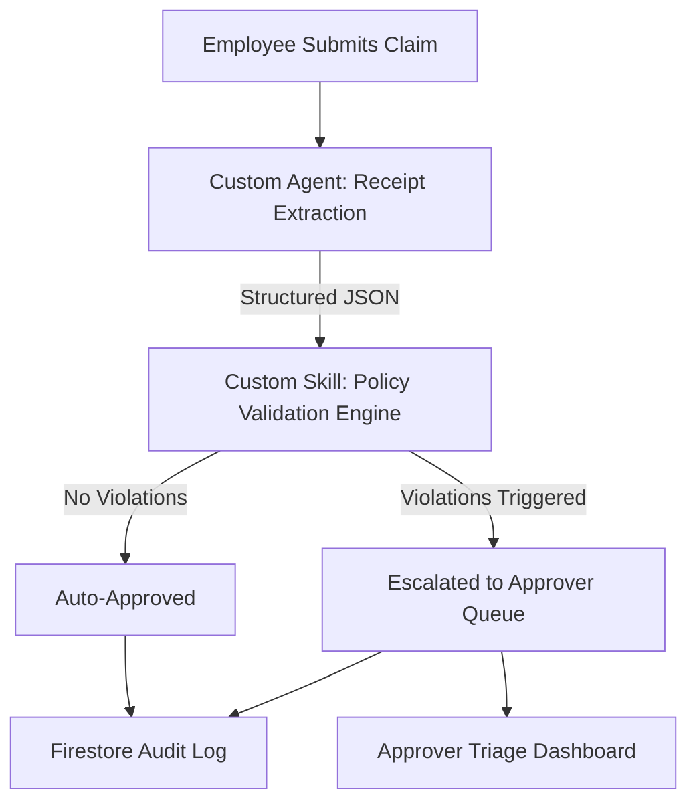

# Custom Agents & Skills Specification — FairLine

This document specifies the architecture, data contracts, rules, implementation guidelines, and developer constraints for the **Custom Agent** and **Custom Skill** within the FairLine expense triage and discrepancy resolution system.

---

## 🏗️ System Overview

FairLine uses an intelligent, automated pipeline to ingest, extract, validate, and route expense claims. The pipeline establishes a clear separation of concerns between AI-driven extraction and deterministic policy enforcement:

1. **Custom Agent (Receipt Extraction):** Uses a Vision-Language LLM to extract structured data from unstructured receipt files.
2. **Custom Skill (Policy Validation Engine):** Evaluates the extracted data and manual inputs against deterministic business rules.



---

## 🤖 Custom Agent: Receipt Extraction

The Receipt Extraction agent is a multimodal AI agent responsible for transforming unstructured receipt images into clean, structured data.

### Technical Specification
* **LLM Engine:** Gemini 1.5 Flash (Vision-capable).
* **Code Comment Label:** `# Custom Agent`
* **Output Format:** Strict JSON matching a Pydantic schema (no free-form text or explanation).

### Pydantic Data Contract
```python
from pydantic import BaseModel, Field

class ExtractedReceiptData(BaseModel):
    merchant: str = Field(description="Name of the merchant/vendor")
    total_amount: float = Field(description="Total invoice/receipt amount extracted from the image")
    date: str = Field(description="Date of the receipt in YYYY-MM-DD format (or closest match)")
    confidence_score: float = Field(
        description="Confidence score between 0.00 and 1.00 indicating LLM's certainty of the extraction"
    )
```

### Prompt & Execution Requirements
1. **Multimodal Ingestion:** The agent must accept both the receipt image and the prompt context containing user manual inputs.
2. **JSON Enforcement:** The backend must parse the Gemini response directly into the `ExtractedReceiptData` model. If the model output fails validation, the extraction must fail gracefully.
3. **No Free-Form Responses:** Preamble text, conversational explanations, or Markdown fences outside of standard JSON are strictly prohibited.

---

## 🛠️ Custom Skill: Policy Validation Engine

The Policy Validation engine is a deterministic Python rules engine acting as a custom skill for the system. It ingests the agent's structured JSON output, cross-references it with business rules, and flags discrepancies to generate an `EvidencePacket`.

### Technical Specification
* **Engine Type:** Deterministic Python function.
* **Code Comment Label:** `# Custom Skill`
* **Workflow Integrity:** Under no circumstances should a claim bypass the policy validation.

### Core Rules (Hardcoded)
Every submitted claim must run through all 3 hardcoded rules before determining its path:

| Rule ID | Rule Name | Condition | Escalation Triggered |
| :--- | :--- | :--- | :--- |
| **Rule 1** | Amount Mismatch | `manual_inputs.amount` != `extracted_data.total_amount` | `AMOUNT_MISMATCH` |
| **Rule 2** | Missing Documentation | `category` == "Meals" AND `amount` > 50 AND `receipt_image_url` is null/empty | `MISSING_DOCUMENTATION` |
| **Rule 3** | Low Confidence | `extracted_data.confidence_score` < 0.85 | `LOW_CONFIDENCE_EXTRACTION` |

### Output Contract: Evidence Packet
```python
from pydantic import BaseModel, Field

class EvidencePacket(BaseModel):
    is_escalated: bool = Field(description="True if any policy rules were violated")
    flagged_rule_ids: list[str] = Field(default_factory=list, description="List of violated rules (e.g., ['AMOUNT_MISMATCH'])")
    explanation: str = Field(description="Detailed explanation of the rule breaches for the human reviewer")
```

---

## 📝 Firestore Schema & Auditing Requirements

To comply with the FairLine development guidelines, all state transitions must be logged in Firestore.

### 1. `claims` Collection
* `claim_id` (String, UUID)
* `status` (Enum: `PENDING`, `AUTO_APPROVED`, `ESCALATED`, `MANUAL_APPROVED`, `MANUAL_REJECTED`)
* `manual_inputs` (Object: amount, category, date, cost_center)
* `receipt_image_url` (String, Firebase Storage link)
* `extracted_data` (Object matching `ExtractedReceiptData`) — *Populated by Custom Agent*
* `evidence_packet` (Object matching `EvidencePacket`) — *Populated by Custom Skill*

### 2. `audit_logs` (Sub-collection of `claims`)
Every action, extraction, and validation must write to the `audit_logs` collection. No state change may happen silently.
* `log_id` (String, UUID)
* `timestamp` (ISO 8601 String)
* `actor` (Enum: `EMPLOYEE`, `CUSTOM_AGENT`, `CUSTOM_SKILL`, `APPROVER`)
* `action` (String)
* `details` (String, JSON payload)

---

## 🛑 Strict Agent Developer Constraints
When writing or editing code for FairLine, agents (Cline, Gemini, etc.) must follow these guardrails:
1. **Explicit Commenting:** Always tag blocks containing extraction with `# Custom Agent` and validation engine logic with `# Custom Skill`.
2. **Deterministic Triage:** Never auto-approve a claim without running all 3 rules.
3. **Audit Log Coverage:** Every status update or data change must produce an audit log entry.
4. **Git Commit Frequency:** Commit after completing each task (do not accumulate massive changes).
